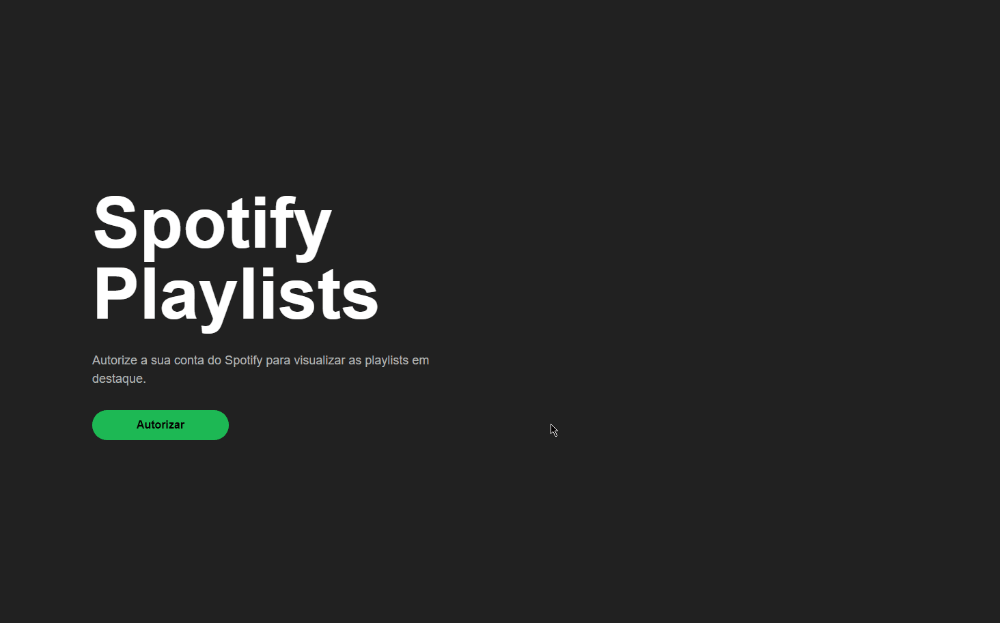

# Market Media - React

<div align="center">
  
</div>

## Descrição

Assim que o usuário abrir a aplicação, um botão contendo um link para autorizar o acesso ao Spotify será exibido

Caso o usuário não conceda a autorização, será exibida uma mensagem informando que é necessário autorizar sua conta para visualizar as playlists

Ao autorizar a aplicação, serão exibidos filtros para as playlists, esses filtros estão sendo montados a partir da API fornecida.

Quando o valor de um filtro for alterado, o retorno da API de playlists será atualizado automaticamente

A cada 30 segundos, os dados das playlists são atualizados

## Detalhes da arquitetura

  A aplicação está utilizando os React Hooks para evitar renderizações desnecessárias dos componentes

  ESLint, Prettier e o Editor Config foram implementados para manter a organização do código, mesmo se várias pessoas estiverem contribuindo para este projeto

  Pensando na escalabilidade da aplicação, ela foi desenvolvida utilizando TypeScript

  As requisições às APIs foram realizadas através da biblioteca Axios

  A aplicação está totalmente responsiva com o uso da unidade de medida `rem`, além do display `grid` e `flex`

## Ferramentas utilizadas

- Typescript
- NextJS
- styled-components
- Hooks
- Axios
- ESLint
- Prettier
- EditorConfig

## Iniciando a aplicação
Para iniciar a aplicação, basta instalar as dependências e rodar o comando:

```bash
npm run dev
# ou
yarn dev
```
